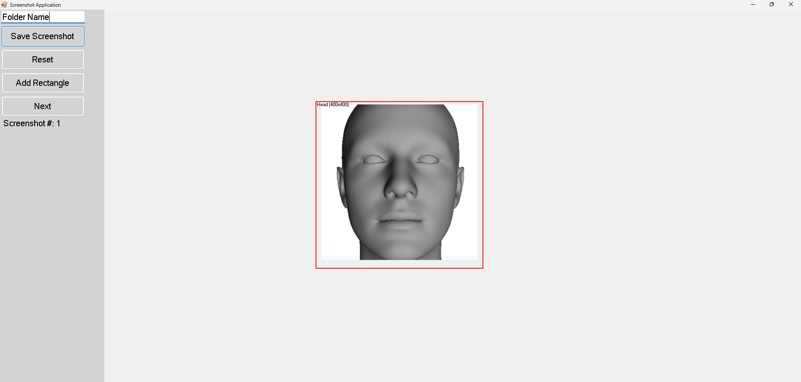

# TakeScreenShot

TakeScreenShot is a Windows Forms application that allows users to capture screenshots, annotate them with rectangles, and save cropped images. This project is built using C# and .NET Framework.

## Features

1. **Take Full-Screen Screenshot**:
   - Captures the entire screen and displays it in the application.

2. **Add Rectangles**:
   - Allows users to add rectangular regions on the screenshot for cropping or annotation.

3. **Drag and Resize Rectangles**:
   - Users can drag and resize rectangles to adjust their position and dimensions.

4. **Edit Rectangle Properties**:
   - Users can rename rectangles and modify their size using an input dialog.

5. **Save Cropped Screenshots**:
   - Crops the screenshot based on the defined rectangles and saves them as individual image files in a user-specified folder.

6. **Next Screenshot**:
   - Clears the current screenshot and increments the screenshot counter for the next capture.

7. **Reset Application**:
   - Resets the application by clearing all rectangles, resetting the screenshot counter, and clearing the preview.

8. **Save and Load Rectangles**:
   - Saves rectangle data (position, size, and name) to a JSON file and reloads it when the application starts.

9. **Dynamic Opacity Adjustment**:
   - Adjusts the application's opacity when interacting with the UI for better visibility.

10. **Preview Cropped Images**:
    - Displays a preview of the cropped images after saving.

11. **User-Friendly UI**:
    - Includes a flow panel with buttons and text boxes for easy navigation and input.

12. **Folder Name Input**:
    - Users can specify a folder name for saving screenshots.

13. **Mouse Interaction**:
    - Supports mouse events like dragging, resizing, and double-clicking for editing rectangles.

## Project Structure
TakeScreenShot.sln .vs/ TakeScreenShot/ v16/ .suo packages/ Newtonsoft.Json.13.0.3/ ... TakeScreenShot/ App.config packages.config Program.cs ScreenshotApp.cs ScreenshotApp.Designer.cs ScreenshotApp.resx TakeScreenShot.csproj bin/ Debug/ Release/ ... obj/ Debug/ Properties/ AssemblyInfo.cs Resources.Designer.cs Resources.resx Settings.Designer.cs

## Prerequisites

- Visual Studio (2019 or later)
- .NET Framework (4.7.2 or compatible)
- [Newtonsoft.Json](https://www.newtonsoft.com/json) (included in the `packages` folder)

## Getting Started

1. Clone the repository:

   ```sh
   git clone https://github.com/ajiteveryone8/takescreenshot
   
2. Open the TakeScreenShot.sln file in Visual Studio.

3. Restore NuGet packages:
    Go to Tools > NuGet Package Manager > Manage NuGet Packages for Solution.
    Restore the required packages.
   
4. Build and run the project.

## Usage
1. Launch the application.
2. Use the interface to:
    - Take a full-screen screenshot.
    - Add, drag, resize, and edit rectangles.
    - Save cropped screenshots to a folder.
    -  Reset the application or move to the next screenshot.
3. Edit Rectangle Name and Size:
    - Double-click on a rectangle to edit its name and size.
    -  The rectangle name is used in the saved screenshot file name.
4. Save and load rectangle data for future use.

## Example Screenshot
Below is an example screenshot captured and annotated using the application:


## Contributing
  Contributions are welcome! Please follow these steps:

1.Fork the repository.
2.Create a new branch for your feature or bug fix.
3. Commit your changes and push them to your fork.
4. Submit a pull request.

## License
This project is licensed under the MIT License. See the LICENSE file for details.

##Acknowledgments
Newtonsoft.Json for JSON serialization and deserialization.

